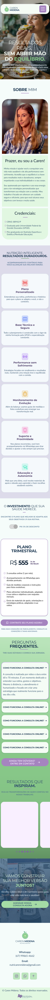

# 🥗 Landing Page para Nutricionista Caren Midena

Esta é uma landing page responsiva desenvolvida para um serviço de nutrição, focada em conversão e design limpo.

> **Status do Projeto:** Concluído ✅
> **Link do Projeto:** [Acesse aqui](https://apfeitoza.github.io/nutri-landing-page/)

---

## 🎨 Layout do Figma
Aqui você pode visualizar o protótipo que serviu de base para este projeto:




[Acesse o layout original aqui]( https://www.figma.com/design/ZMtMycIp7WYxIKjvL66FaC/Projeto-Landing-Page---Caren?node-id=47-28&m=dev&t=Kh1qzwRIKAYXSBek-1)

---

## 🚀 Tecnologias Utilizadas<!-- {"fold":true} -->
O projeto foi construído utilizando as seguintes ferramentas:
 -  Estrutura semântica.
 - Estilização modular com arquitetura de arquivos separada.
 - Sistema de Grid e componentes responsivos.
 - Interações de menu e comportamento do site.
 - Prototipação e Design UI.
—
## 🗂️ Estrutura de Pastas<!-- {"fold":true} -->

```
nutri-landing-page
├─ README.md
├─ css
│  ├─ style.css
│  └─ style.scss.map
├─ img
│  ├─ favicon
│  │  └─ favicon.ico
│  ├─ icons
│  │  ├─ book.svg
│  │  ├─ food.svg
│  │  ├─ gym-bar.svg
│  │  ├─ kiwi-icon.svg
│  │  ├─ laranja-Icon.svg
│  │  ├─ melancia-icon.svg
│  │  ├─ mirtilo-icon.svg
│  │  ├─ mortarboard.svg
│  │  ├─ phone.svg
│  │  └─ stopwatch.svg
│  ├─ logo
│  │  ├─ Mylogo.svg
│  │  ├─ kiwi-logo.svg
│  │  └─ kiwi-stamp.svg
│  └─ photo
│     ├─ caren-2.jpg
│     ├─ caren.jpg
│     ├─ img-1.jpg
│     ├─ img-2.jpg
│     └─ img-3.jpg
├─ index.html
├─ js
│  ├─ bootstrap.bundle.min.js
│  └─ script.js
├─ package-lock.json
├─ package.json
└─ scss
   ├─ _cta.scss
   ├─ _depoimentos.scss
   ├─ _faq.scss
   ├─ _footer.scss
   ├─ _global.scss
   ├─ _hero.scss
   ├─ _metodo.scss
   ├─ _navbar.scss
   ├─ _planos.scss
   ├─ _sobre.scss
   ├─ _variables-e-mixins.scss
   └─ main.scss

```

---

## 🛠️ Como rodar o projeto localmente<!-- {"fold":true} -->

1. Clone o repositório:
   ```bash
   git clone https://github.com/Apfeitoza/nutri-landing-page.git
   ```

2. Abra o arquivo index.html no seu navegador (ou use a extensão Live Server no VS Code).

## 📱 Responsividade<!-- {"fold":true} -->
O site foi desenvolvido seguindo o conceito Mobile-First, garantindo que a experiência seja fluida em celulares, tablets e desktops. 

## 📄 Licença
Este projeto está sob a licença MIT.

Feito com ❤️ por [Apfeitoza].

